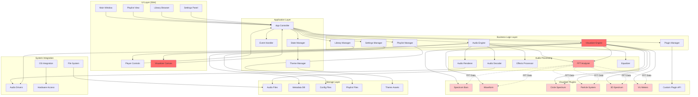

# System Architecture Diagram

```mermaid
graph TB
    subgraph "UI Layer (Slint)"
        A[Main Window]
        B[Player Controls]
        C[Playlist View]
        D[Library Browser]
        E[Visualizer Canvas]
        F[Settings Panel]
    end

    subgraph "Application Layer"
        G[App Controller]
        H[State Manager]
        I[Event Handler]
        J[Theme Manager]
    end

    subgraph "Business Logic Layer"
        K[Audio Engine]
        L[Playlist Manager]
        M[Library Manager]
        N[Visualizer Engine]
        O[Plugin Manager]
        P[Settings Manager]
    end

    subgraph "Audio Processing"
        Q[Audio Decoder]
        R[Audio Renderer]
        S[Effects Processor]
        T[FFT Analyzer]
        U[Equalizer]
    end

    subgraph "Visualizer Plugins"
        V1[Spectrum Bars]
        V2[Waveform]
        V3[Circle Spectrum]
        V4[Particle System]
        V5[3D Spectrum]
        V6[VU Meters]
        V7[Custom Plugin API]
    end

    subgraph "Storage Layer"
        W[Audio Files]
        X[Metadata DB]
        Y[Config Files]
        Z[Playlist Files]
        AA[Theme Assets]
    end

    subgraph "System Integration"
        BB[File System]
        CC[Audio Drivers]
        DD[OS Integration]
        EE[Hardware Access]
    end

    %% UI to Application
    A --> G
    B --> G
    C --> G
    D --> G
    E --> G
    F --> G

    %% Application Layer connections
    G --> H
    G --> I
    H --> J

    %% Application to Business Logic
    G --> K
    G --> L
    G --> M
    G --> N
    G --> O
    G --> P

    %% Business Logic internal connections
    K --> Q
    K --> R
    K --> S
    K --> T
    K --> U

    N --> T
    N --> V1
    N --> V2
    N --> V3
    N --> V4
    N --> V5
    N --> V6
    O --> V7

    %% Storage connections
    L --> Z
    M --> X
    P --> Y
    J --> AA
    Q --> W

    %% System Integration
    R --> CC
    BB --> W
    DD --> EE
    K --> CC

    %% Visual feedback
    N --> E
    K --> B

    %% Data flow for visualizer
    T -.->|FFT Data| V1
    T -.->|FFT Data| V2
    T -.->|FFT Data| V3
    T -.->|FFT Data| V4
    T -.->|FFT Data| V5
    T -.->|FFT Data| V6

    style N fill:#ff6b6b
    style E fill:#ff6b6b
    style T fill:#ff9999
    style V1 fill:#ffcccc
    style V2 fill:#ffcccc
    style V3 fill:#ffcccc
    style V4 fill:#ffcccc
    style V5 fill:#ffcccc
    style V6 fill:#ffcccc
```
